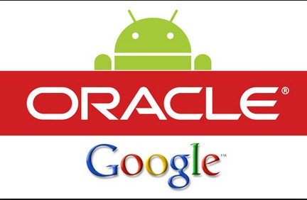

关于“Google在Android平台使用Java侵犯知识产权”一案，2014年5月，联邦法院判定Oracle获胜，这个结果完全出人意料，因为这样一来无异于打开了软件开发领域中API使用方式的潘多拉之盒。Android使用的Java API是基于Google自己开发的Dalvik虚拟机，Google也因此就侵权问题提出了自己的异议，因为他们用的根本就不是Oralce的Java虚拟机(JVM)。

尽管Java是一个开源平台，任何开发者都应该能够自由访问和使用，但是Oracle认为，这个开源条款不适用于API包（具体指API包的组织形式——译者注）。“对于Java编程语言的开源性是毋庸置疑的，任何人都能免费使用”，联邦法庭裁定中写道，“但是下列三项API包则不在这个开源范围之内，因为Google很明显能够使用Java语言 自己重写这些API包，但是他们没有这么做。相反，Google毋庸置疑地拷贝了7000多行的声明代码，并几乎复制了整体的代码结构，序列，组织形式，这些东西都是Oralce Java API中已经存在的……被指控侵权的37个Java API包都在声明的开头标注了版权保护说明。”

联邦法院的这一裁决推翻了下级法院在两年前做出的关于：“API不受美国版权法律保护”的判决，Google当时做为被告胜诉。其实上诉法庭现在的判决并不是已经判定了被控侵权的API已受到法律保护；其受到保护与否要根据初始法院再组织的新陪审团来进行判断。上诉法庭的判决实际上是说，这些API有可能会被版权法保护，两年前下级法院的“不被保护”的裁决是错误的。

如今法庭裁决“API可能受保护”这一结果，将可能导致技术工业领域一场全新的知识产权的战争。这些战争多半都是关于Android的——比如那些有年头的旧案子：“三星状告苹果侵犯专利权”——但是这一判决导致的指向性可能会影响到所有的开发者。一直以来，Oracle的法律官司都是业界的恐怖噩梦，很可能将Android和开源软件都拖入无底的泥淖。现在，这个噩梦部分地，成真了。

“我不是律师，但是仅从一名开发者的角度来看，对API进行版权限制只会给软件开发的协作一体化带来摩擦和混乱，因为程序员无法使用API来完成任务了。”，Jeffery Hammonds（Forrester Research副总裁）表示，“开发者必须要担心API中潜在的侵权问题，而且供应商也必须要承担同样的风险。我不认为像这样制造恐惧和不确定性会对软件开发者有什么好处，尤其是对第三方服务来说，这更加糟糕。”

“避免Java语言碎裂化，这是Oracle一直以来坚持追求的目标，这是有价值的，但是我们不认为给API加上版权会有利于实现这个目标。”，Ed Anuff(Apigee产品策略副总裁，Apigee是一家提供云端API接入的服务商）说，“相反这样做是起到了反作用，反而使得API不得不变得更加复杂，以此来规避那些政治或法律层面的问题。这样一来，会造成一个双输的局面，对参与者毫无益处可言。”

自然，Oracle的代理律师Josh Rosenkarz对这个裁决非常满意，他表示：“今天，联邦法院巡回法庭保证了创新者的利益能够得到保护。” 关于下级法院就此诉讼再次开庭前，Oracle是否会主动达成庭外和解的问题，Oracle目前还没有对此发表任何回复；Google对此也没有发表任何意见。